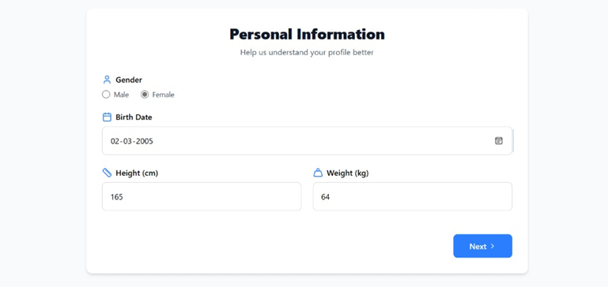
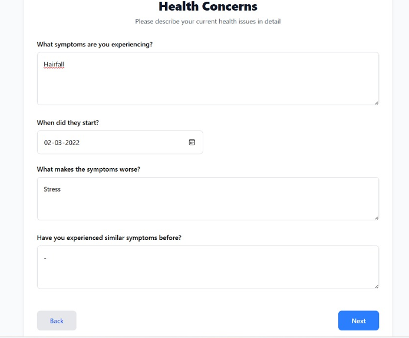
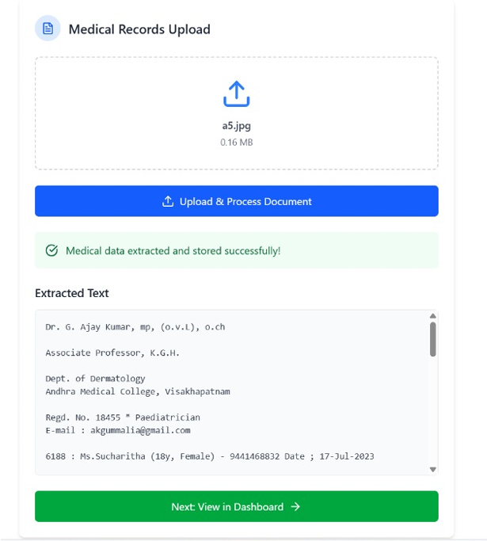
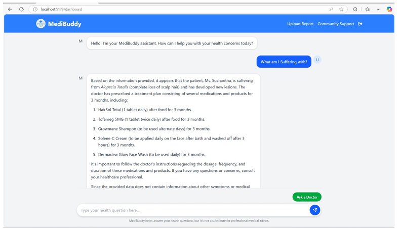

# MediBuddy – AI-Powered Health Assistant for Personalized Health Insights

---

## Project Overview

**MediBuddy** is an AI-powered healthcare assistant designed to provide **personalized health insights** by analyzing user medical records and external medical knowledge sources. It leverages OCR, NLP, and RAG-based LLM technologies to make healthcare data more accessible and actionable.  

---

## Key Features

- **Image Reports:** Extracted using Python + Tesseract OCR  
- **PDF Reports:** Parsed with Upstage AI  
- **Knowledge Base:** Gale Encyclopedia loaded via PyPDFLoader and stored as embeddings in Pinecone  
- **Embeddings:** Text converted using all-MiniLM-L6-v2  
- **AI Chatbot:** Mistral-7B-Instruct-v0.3 via Together AI for personalized responses  

---

## Tech Stack

| Layer        | Technology                                      |
|-------------|------------------------------------------------|
| Backend      | Go, PostgreSQL                                  |
| Frontend     | React, Tailwind CSS                             |
| AI & NLP     | Python, Tesseract OCR, Upstage AI, Together AI |
| Vector Store | Pinecone                                       |
| Embeddings   | all-MiniLM-L6-v2                               |

---

## How It Works

1. Users upload **medical reports** in **image (JPG, PNG)** or **PDF** formats.  
2. **OCR** extracts text from images, and PDFs are parsed using **Upstage AI**.  
3. Extracted medical data is stored in **PostgreSQL**.  
4. The **knowledge base** (Gale Encyclopedia) is processed into **vector embeddings** and stored in **Pinecone**.  
5. When a user asks a question:  
   - The system retrieves the **user’s medical data** from PostgreSQL.  
   - Retrieves **relevant knowledge snippets** from Pinecone embeddings.  
   - Combines both as context using **RAG** and sends it to the **Mistral-7B-Instruct-v0.3 chatbot**.  
6. The chatbot generates a **personalized, context-aware answer** based on both the user’s data and external knowledge.  

---

## MediBuddy in Action

### 1. User Account Creation Interface
This figure showcases the user interface for account creation. It includes fields for users to input their personal information such as name, email, password, and phone number. This data is crucial for user authentication and personalization of the healthcare assistant system, ensuring secure access to medical records and tailored responses.  

### 2. Personal Information Collection Form
This figure illustrates the interface for collecting personal health data, including gender, birth date, height, and weight. These details are essential for personalizing the chatbot’s health insights and ensuring accurate responses based on the user’s demographics and health profile.  

### 3. Health Concerns Collection Form
This figure displays the interface for collecting detailed health concerns, including symptoms, start dates, and information about when the symptoms worsen. This data allows the chatbot to provide context-specific medical advice, generating accurate and personalized responses based on the user’s ongoing health conditions.  

### 4. Medical Record Upload and Extracted Data Preview
This figure illustrates the interface where users can upload their medical records. The system automatically processes the document, extracts relevant health information, and displays it in a structured format. Users can review the extracted data to ensure that diagnoses, medications, and test results are accurately captured for personalized chatbot responses.  

### 5. Chatbot Interaction with User Query and Model Response
This figure depicts an example interaction between the user and the chatbot. The user asks a health-related query, and the model generates a response based on the user’s medical records and relevant knowledge from the knowledge base. This showcases the system’s ability to provide personalized, contextually relevant answers using RAG and LLM integration.  

